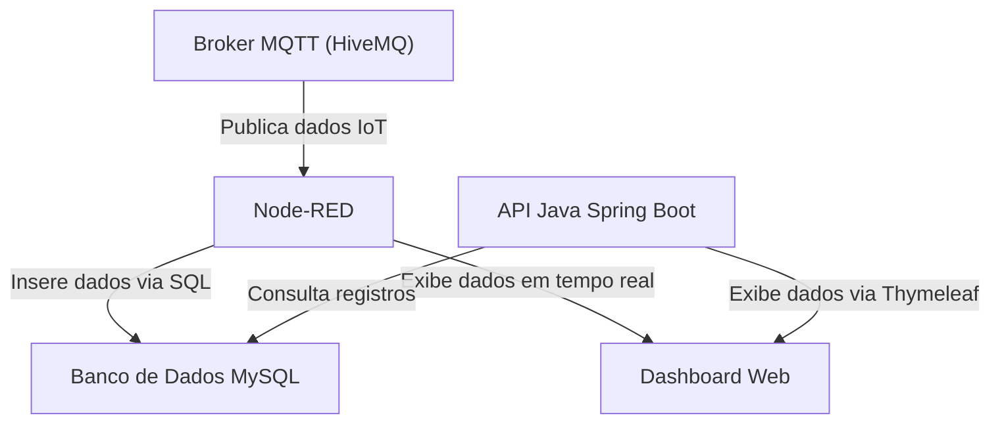

🚀 IoT Mottu - Integração com Banco de Dados MySQL e API Java
📝 Proposta e Funcionalidades

Este projeto implementa uma solução completa de monitoramento IoT para motocicletas, desenvolvida como parte do Challenge da FIAP (Sprint 4).
O sistema foi projetado para coletar, processar, visualizar e armazenar dados de telemetria em tempo real, integrando o Node-RED e uma API Java Spring Boot com um banco de dados MySQL.

O objetivo principal é demonstrar uma arquitetura moderna de IoT, onde o Node-RED recebe dados de sensores (via MQTT), os processa e os grava diretamente no banco de dados.
A API Java, por sua vez, realiza a leitura e disponibiliza as informações para consulta, relatórios e visualização web (via Thymeleaf).

🔧 Módulos e Funcionalidades

🟠 Node-RED (Middleware IoT):

Recebe dados de sensores simulados via Broker MQTT (HiveMQ).

Exibe informações em tempo real no Dashboard (distância, estado e dispositivo).

Persiste automaticamente os dados recebidos no banco de dados MySQL por meio de um conector SQL.

🟢 Banco de Dados (MySQL):

Responsável pelo armazenamento dos registros de telemetria.

Contém a tabela historico, onde são salvos os dados enviados pelo Node-RED.

🟣 API Java (Spring Boot):

Lê os dados diretamente do banco MySQL.

Oferece endpoints REST para consulta de registros e uma interface web via Thymeleaf.

Foi desenvolvida seguindo a arquitetura MVC, com camadas Controller, Service e Repository.

🏛️ Arquitetura do Projeto

O sistema segue o modelo publish/subscribe, com persistência direta em banco e integração indireta com a API.

🔄 Fluxo de Dados:

Dispositivo IoT ou Simulador Node-RED publica mensagens JSON no Broker MQTT (HiveMQ).

O Node-RED consome as mensagens, exibe os valores no Dashboard e insere os dados no banco MySQL.

A API Java Spring Boot acessa o banco para exibir, consultar e listar os registros de telemetria.

🧩 Componentes Utilizados
Componente	Função
Node-RED	Middleware responsável por processar e armazenar os dados IoT
Broker MQTT (HiveMQ)	Responsável pela comunicação entre dispositivos e o Node-RED
MySQL	Banco de dados relacional que armazena os registros de telemetria
API Java (Spring Boot)	Lê e exibe os dados persistidos no banco
Thymeleaf	Ferramenta para renderizar páginas HTML com dados da API
Dashboard Node-RED	Interface visual para monitoramento em tempo real
🧱 Estrutura da Tabela de Telemetria
CREATE TABLE historico (
  id INT AUTO_INCREMENT PRIMARY KEY,
  distancia DECIMAL(10,2),
  estado VARCHAR(50),
  busca VARCHAR(50),
  timestamp DATETIME,
  dispositivo VARCHAR(100)
);

👩‍💻 Integrantes do Grupo

Enzo Prado Soddano — RM557937

Lucas Resende Lima — RM556564

Vinicius Prates Altafini — RM556183

🔗 Links do Projeto

Link do Video: https://youtu.be/_Ptoz1NUe_Y

Link do WorkWi: https://wokwi.com/projects/442734327702711297

▶️ Execução do Projeto

Inicie o Broker MQTT (HiveMQ) — o Node-RED se conectará automaticamente.

Execute o fluxo Node-RED e visualize os dados no Dashboard.

Confirme no MySQL que os registros estão sendo salvos na tabela historico.
